# NSphere-SIDM

**Self-Interacting Dark Matter (SIDM) fork of [NSphere](https://github.com/kris-sigurdson/NSphere)**

Implements SIDM scattering physics, anisotropic velocity distributions, and many other enhancements.  
For a comprehensive list of changes see the [change log](CHANGELOG.md).

<table width="100%">
<tr>
<td width="30.3%">
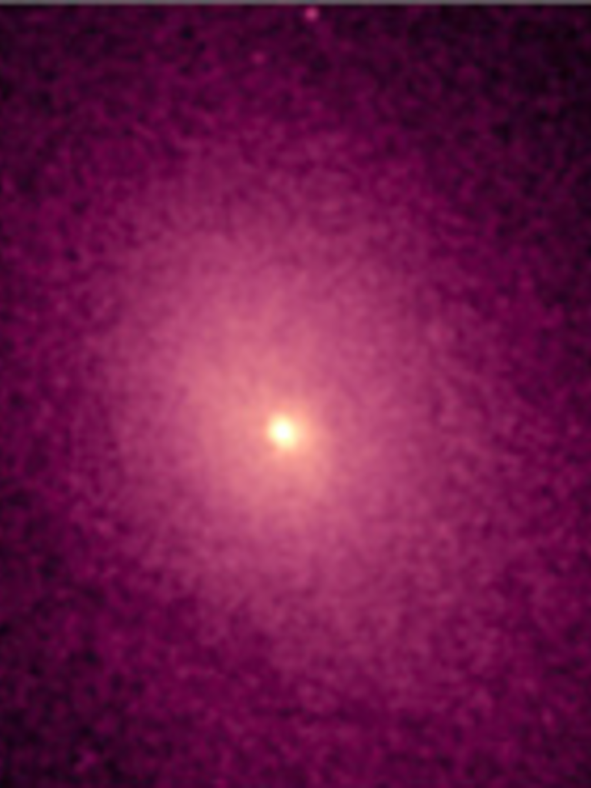
</td>
<td width="39.4%" align="center">
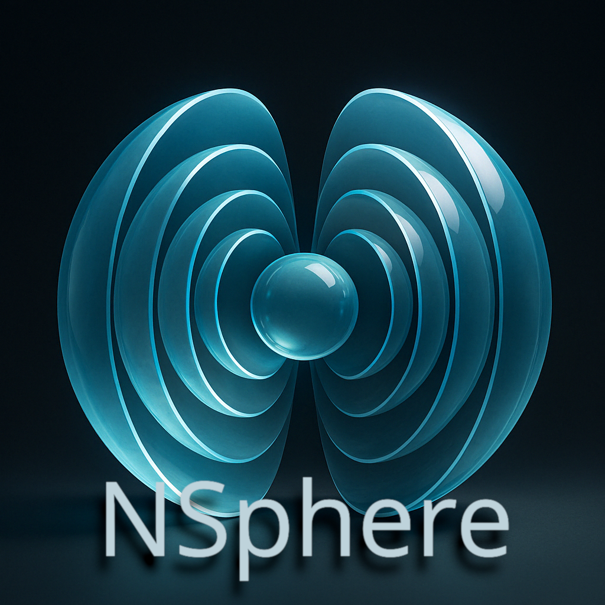
</td>
<td width="30.3%">
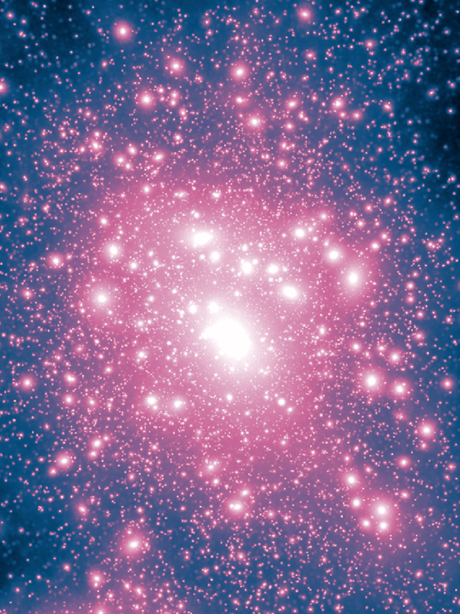
</td>
</tr>
</table>

<div align="center">

[](https://nsphere-sidm.github.io/NSphere-SIDM/) [](LICENSE) [](https://arxiv.org/abs/2506.04334) [](https://arxiv.org/abs/2504.13996) [](https://arxiv.org/abs/2510.23705)

</div>

<div align="justify">

Please see **Kamionkowski & Sigurdson (2025), [arXiv:2504.13996](https://arxiv.org/abs/2504.13996)** if you use **NSphere** (citation details below).
The SIDM physics implementation is described in **Kamionkowski, Sigurdson & Slone (2025), [arXiv:2506.04334](https://arxiv.org/abs/2506.04334)**.
Anisotropic velocity distribution support is described in **Kamionkowski & Sigurdson (2025), [arXiv:2510.23705](https://arxiv.org/abs/2510.23705)**.

</div>

---

## Quick Navigation
- [Key Results from SIDM Simulations](#key-results-from-sidm-simulations)
- [Key Results from Anisotropic SIDM Simulations](#key-results-from-anisotropic-sidm-simulations)
- [Overview](#overview)
- [Numerical Implementation](#numerical-implementation)
- [Core Components & Usage](#core-components--usage)
- [Installation](#installation)
- [Running NSphere](#running-nsphere)
- [Examples](#examples)
- [Data and Results Flow](#data-and-results-flow)
- [Citation](#citation)
- [Dependencies and Acknowledgments](#dependencies-and-acknowledgments)
- [Building Documentation](#building-documentation-optional)

---

## Key Results from SIDM Simulations

<div align="center">
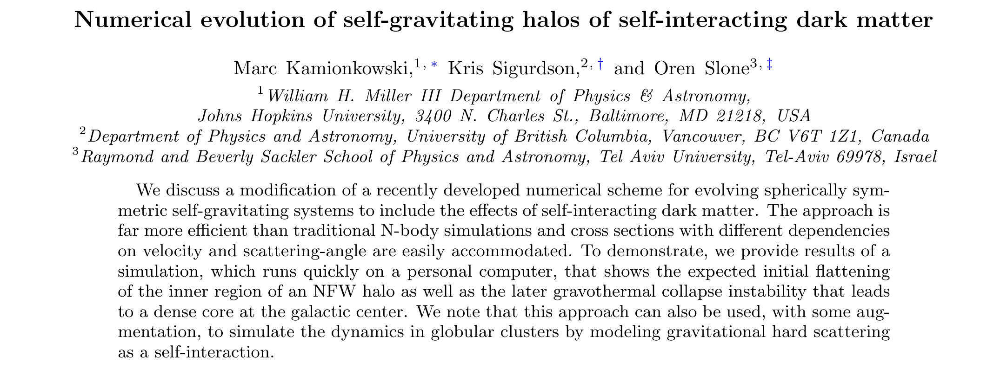
</div>

<sub>Explore these results online in our [interactive notebooks](https://nsphere-sidm.github.io/NSphere-SIDM/examples/index.html).</sub>

<table>
<tr>
<td width="33%"></td>
<td width="33%">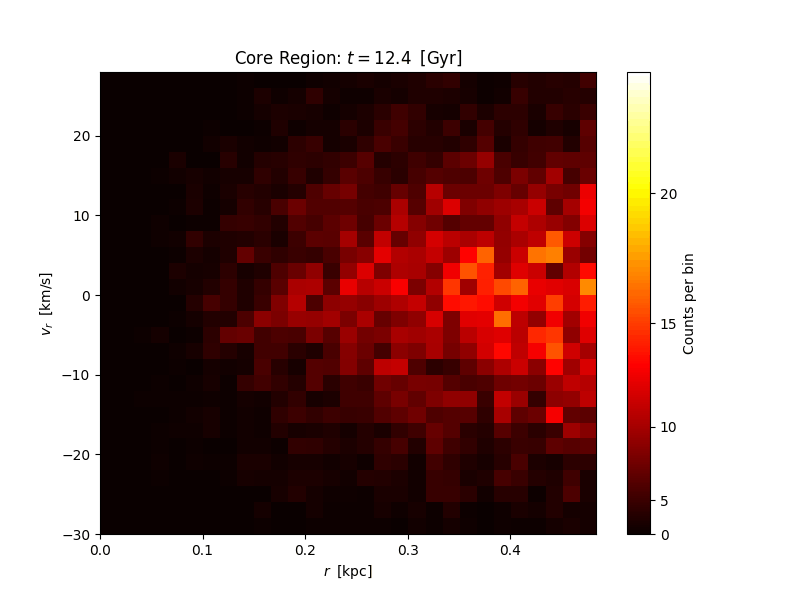</td>
<td width="33%">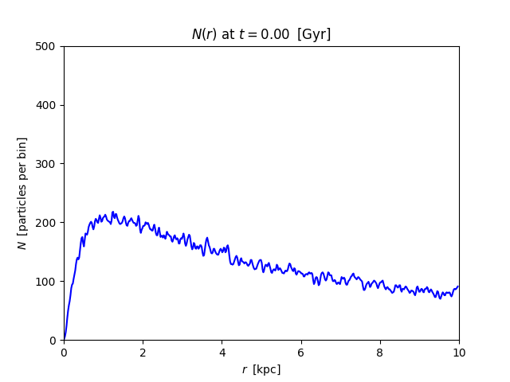</td>
</tr>
<tr>
<td align="justify"><sub><sup><b>SIDM Phase Space Evolution:</b> Animation showing the complete 19.6 Gyr evolution of the phase space (r, v<sub>r</sub>) distribution for 10<sup>5</sup> particles with σ/m = 50 cm²/g. The system begins with an NFW profile and evolves under both gravity and SIDM scattering. Core formation becomes evident after ~15 Gyr, followed by rapid collapse.</sup></sub></td>
<td align="justify"><sub><sup><b>Collapse of Core Region:</b> Zoomed view of the central 0.5 kpc during the critical gravothermal collapse period from 12.4 Gyr to 16.4 Gyr. The phase space shows dramatic heating and concentration of particles as the core density rises exponentially. Color scale emphasizes high-density regions using power-law normalization.</sup></sub></td>
<td align="justify"><sub><sup><b>Particle Distribution Evolution:</b> Animation of N(r) showing particles per radial bin over 19.6 Gyr. The initial NFW cusp at r < 0.1 kpc flattens within 1 Gyr due to SIDM heat transfer. After ~15 Gyr, particles accumulate rapidly in the center as gravothermal collapse begins, forming a sharp density spike.</sup></sub></td>
</tr>
</table>

<table>
<tr>
<td width="33%">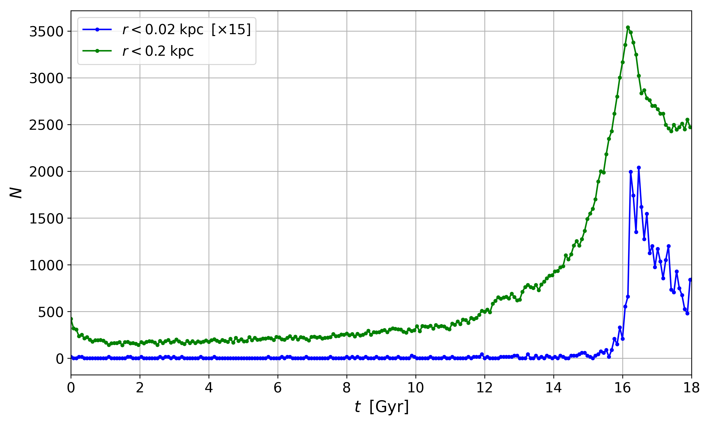</td>
<td width="33%">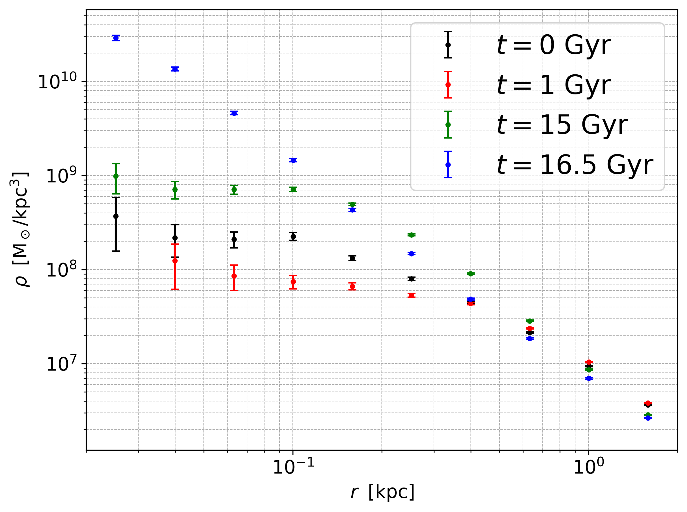</td>
<td width="33%">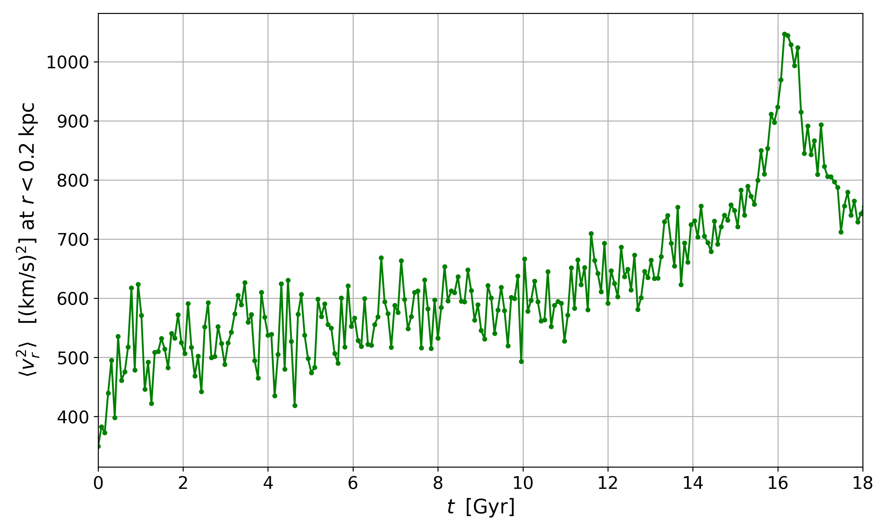</td>
</tr>
<tr>
<td align="justify"><sub><sup><b>Core Particle Accumulation:</b> Time evolution of the number of particles in the innermost 0.02 kpc (blue) and 0.2 kpc (green). The number within 0.02 kpc is scaled up by 15. The number of particles quickly decreases from its initial value then slowly increases until about t=16 Gyr, with a sharper increase in the innermost regions. The decrease after 16.5 Gyr is a numerical artifact from finite time resolution.</sup></sub></td>
<td align="justify"><sub><sup><b>Density Profile Evolution:</b> Time evolution of the inner density profile for a 1.15×10<sup>9</sup> M<sub>⊙</sub> NFW halo with scale radius r<sub>s</sub>=1.18 kpc and SIDM cross section 50 cm²/g. The initial profile (black) has an r<sup>-1</sup> power law at r≲1 kpc, which flattens by t=1 Gyr (red). Steepening from gravothermal instability appears at t≈15 Gyr (green), with further steepening at t=16.5 Gyr (blue).</sup></sub></td>
<td align="justify"><sub><sup><b>Velocity Dispersion Evolution:</b> Time evolution of the radial velocity dispersion in the inner 0.2 kpc. In the first Gyr the initially cold population in the NFW profile is rapidly heated towards isothermality, and the dispersion then diverges as the core forms 16 Gyr later. The sharp rise after 15 Gyr indicates the onset of core collapse.</sup></sub></td>
</tr>
</table>

---

## Key Results from Anisotropic SIDM Simulations

<div align="center">
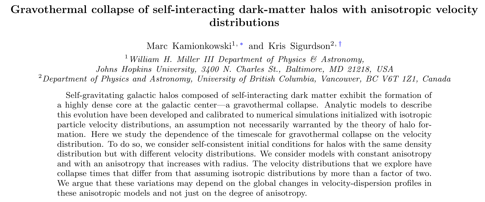
</div>

<sub>Explore these results online in our [Example 3 Notebook](https://nsphere-sidm.github.io/NSphere-SIDM/examples/notebooks/nsphere_notebook_example3.html) which reproduces all 7 paper figures.</sub>

<table>
<tr>
<td width="100%">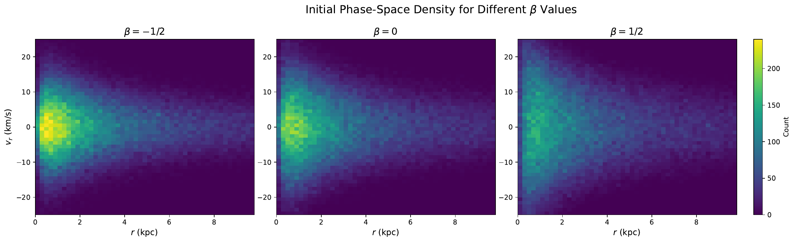</td>
</tr>
<tr>
<td align="justify"><sub><sup><b>Initial Phase-Space Density for Different β Values:</b> Three-panel comparison showing initial distributions in (r, v_r) space for constant-β anisotropy models. Radial velocity spread increases systematically from β=-1/2 (tangential orbits, left) through β=0 (isotropic, center) to β=1/2 (radial orbits, right), demonstrating how anisotropy parameter controls orbital structure while preserving the same Hernquist density profile.</sup></sub></td>
</tr>
</table>

<table>
<tr>
<td width="33%">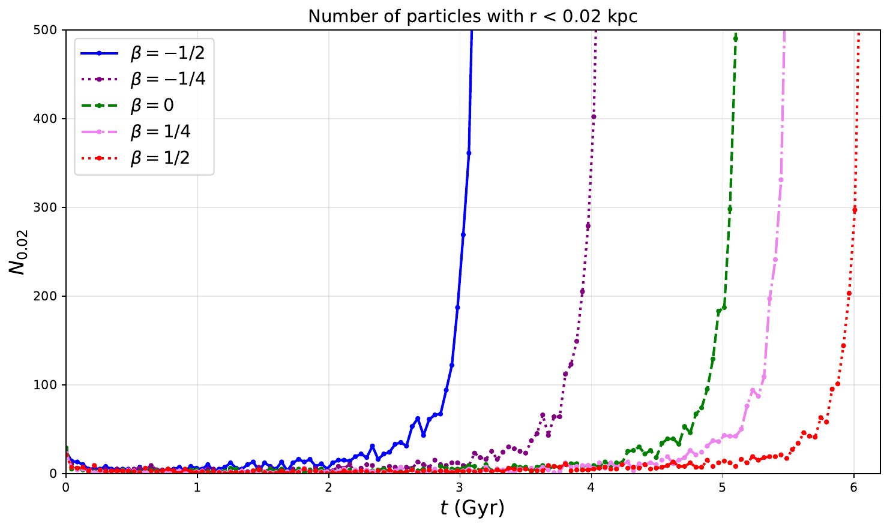</td>
<td width="33%">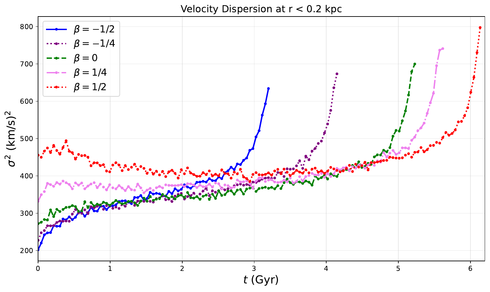</td>
<td width="33%">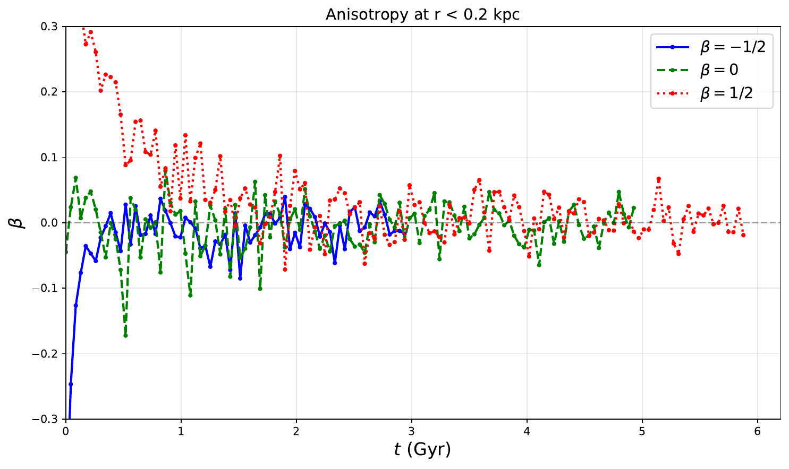</td>
</tr>
<tr>
<td align="justify"><sub><sup><b>Particle Count at r<0.02 kpc:</b> Time evolution showing collapse onset for 5 constant-β models. Particle accumulation varies by factor of ~2 across anisotropy range, with tangential models (β=-1/2, purple) collapsing faster than radial models (β=1/2, red). All models show characteristic accumulation followed by post-collapse decrease.</sup></sub></td>
<td align="justify"><sub><sup><b>Central Velocity Dispersion:</b> Evolution of σ² at r<0.2 kpc showing thermalization (first Gyr) then divergence at collapse. Initial rapid heating drives all models toward thermal equilibrium. Peak values vary systematically with β, demonstrating anisotropy's influence on core heating during gravothermal collapse.</sup></sub></td>
<td align="justify"><sub><sup><b>Anisotropy Parameter Evolution:</b> Time evolution of β(r<0.2 kpc) for three models (β=-1/2, 0, 1/2). Initial anisotropy preserved at t=0, then rapid SIDM-driven thermalization toward isotropy (β→0) within first Gyr. Demonstrates self-interactions' powerful isotropizing effect regardless of initial orbital distribution.</sup></sub></td>
</tr>
</table>

<table>
<tr>
<td width="33%">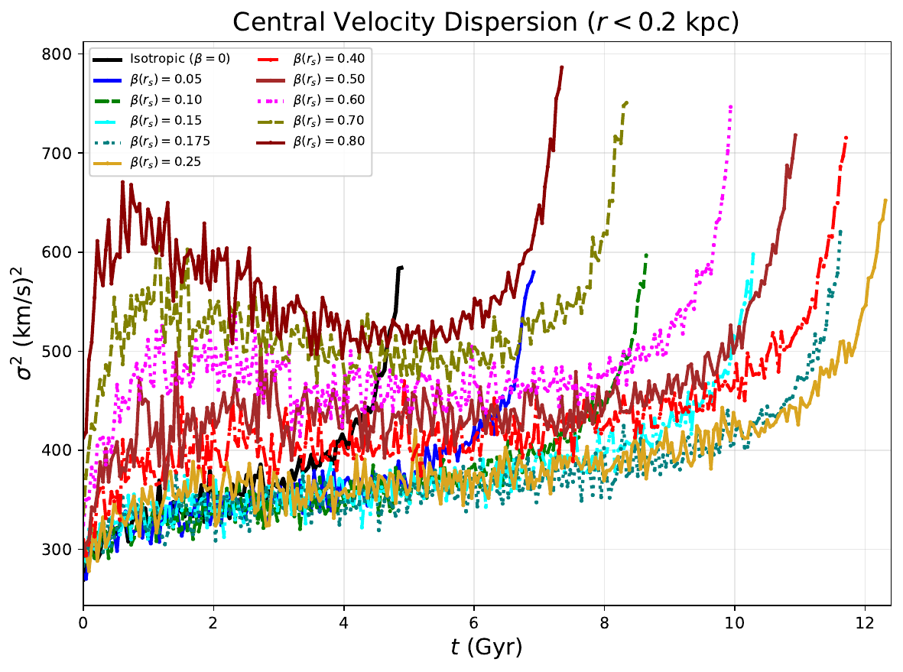</td>
<td width="33%">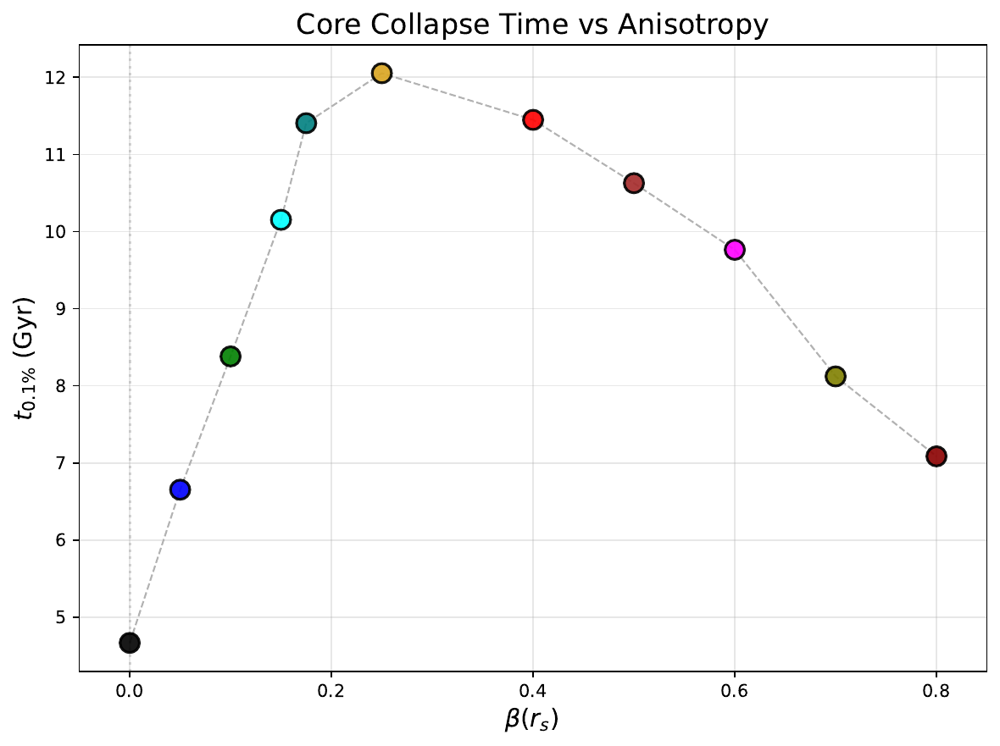</td>
<td width="33%">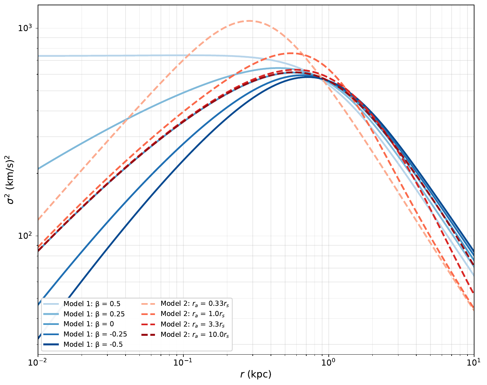</td>
</tr>
<tr>
<td align="justify"><sub><sup><b>Osipkov-Merritt Velocity Dispersion Evolution:</b> Central σ² evolution for 11 OM models with β(r_s) ranging from 0.05 to 0.80. Collapse timing varies non-monotonically spanning 4-12 Gyr. Models with intermediate anisotropy (β(r_s)~0.2-0.3, yellow-green curves) exhibit longest collapse times, while both low and high anisotropy models collapse earlier.</sup></sub></td>
<td align="justify"><sub><sup><b>Collapse Time vs β(r_s):</b> Non-monotonic relationship between OM characteristic anisotropy β(r_s) and gravothermal collapse time (measured at 0.1% threshold). Peak collapse time ~12 Gyr at β(r_s)~0.25, decreasing to ~4.5 Gyr (isotropic) and ~7 Gyr (β(r_s)=0.8). Demonstrates complex interplay between radially-varying velocity anisotropy and core collapse dynamics.</sup></sub></td>
<td align="justify"><sub><sup><b>Initial Velocity Dispersion Profiles:</b> Theoretical σ²(r) calculated from distribution functions via Jeans equation. Blue solid curves show 5 constant-β models (-0.5 to 0.5), red dashed curves show 4 OM models (r_a = 0.33, 1.0, 3.3, 10.0 × r_s). Demonstrates how different anisotropy models produce distinct global velocity-dispersion profiles despite identical density distributions. Log-log scale reveals power-law behavior at small and large radii.</sup></sub></td>
</tr>
</table>

---

## Overview

NSphere simulates the evolution of spherical self-gravitating systems, primarily targeting collisionless dark matter halos in astrophysics. It leverages the inherent spherical symmetry to simplify the complex 𝑁-body problem. By reducing the six-dimensional phase space (position and velocity) to three dimensions (radius `r`, radial velocity `𝑣ᵣ`, and angular momentum `ℓ` or velocity angle), the computational cost is significantly lowered. The core principle is self-consistency: the gravitational potential is generated by the mass distribution of all particles, and particles orbit within that potential. In equilibrium, such systems, described by a phase-space Distribution Function (DF) often dependent on energy (`ε`) and angular momentum (`ℓ`), are generally stable. NSphere provides a tool to efficiently explore how these systems evolve when perturbed or subjected to new physical processes (e.g., dark matter interactions, central black hole growth, external tidal forces) where analytical solutions are intractable.

NSphere also includes self-interacting dark matter physics and anisotropic velocity distributions. Self-interactions are implemented via Monte Carlo scattering with configurable cross-sections, enabling simulation of core formation and gravothermal collapse. Anisotropic velocity distributions can be configured using constant-β models (where β controls the preference for radial versus tangential orbits) or Osipkov-Merritt models (where anisotropy increases with radius). These capabilities enable systematic exploration of how self-interactions and velocity anisotropy affect halo evolution, with simulations demonstrating that gravothermal collapse times can vary by more than a factor of two depending on the initial orbital structure.

<table style="width:100%; border-collapse:collapse;">
  <tr>
    <td align="center" style="width:50%;">
      <br>
      <em>Stable self-gravitating distribution with 10⁵ particles</em>
    </td>
    <td align="center" style="width:50%;">
      <br>
      <em>Tidally stripped system with 1.2 x 10⁷ particles</em>
    </td>
  </tr>
</table>

## Numerical Implementation

**Gravity:** The simulation evolves a system of 𝑁 particles, often representing concentric mass shells. The algorithm proceeds in discrete time steps. At each step:
1.  **Sorting:** Particles are efficiently sorted by their radial coordinate `r`. This allows for rapid calculation of the mass enclosed within any radius, `M(r)`, which determines the gravitational force. The implementation utilizes optimized sorting algorithms like Quadsort, achieving nearly `𝑁 log 𝑁` or even linear scaling for the nearly-ordered data typical between steps.
2.  **Force Calculation:** The gravitational force on each particle is calculated based solely on the mass `M(r)` enclosed within its current radius (Newton's Shell Theorem). Centrifugal force due to angular momentum (`ℓ²/r³`) is added.
3.  **Integration:** Particle states (radius `r` and radial velocity `𝑣ᵣ`) are updated using a numerical integrator. NSphere employs adaptive leapfrog methods, automatically refining the time step for accuracy. For orbits with very low angular momentum approaching the center (`r` -> 0), where standard integration becomes stiff, a Levi-Civita coordinate transformation (`ϱ = √(r)`) and fictitious time (`dτ = dt/r`) are used to regularize the equations of motion and improved stability and accuracy.

This approach significantly reduces computational cost compared to traditional `𝑁²` 𝑁-body methods and mitigates issues like two-body relaxation effects, making it suitable for high-precision studies of spherical systems on standard hardware.

**Self Interactions:** NSphere augments the gravitational evolution with self-interactions via direct Monte Carlo of particle scatterings. At each time step, particles within local phase-space neighborhoods scatter stochastically based on their relative velocities and a user-specified cross-section (σ/m). Pairs scatter in their center-of-mass frame with momentum conserved and randomized directions. The implementation supports parallel execution allowing efficient simulation of SIDM physics including core formation and gravothermal collapse, as detailed in Kamionkowski, Sigurdson & Slone (2025), [arXiv:2506.04334](https://arxiv.org/abs/2506.04334).

**Anisotropy Models:** NSphere supports anisotropic velocity distributions with constant-β or Osipkov-Merritt radially-varying β(r) = r²/(r² + r_a²) models, where β controls orbital preference (β<0 tangential, β=0 isotropic, β>0 radial). Hernquist constant-β distributions are computed analytically using hypergeometric functions with special-case formulas for β=±0.5; other velocity distributions are computed numerically. Osipkov-Merritt models employ the augmented density method where ρ_Q(r) = ρ(r)(1+r²/r_a²) is inverted to obtain f(Q) where Q = ℰ - L²/(2r_a²), pseudo-velocities are sampled using rejection sampling, and coordinate transformations map pseudo-velocities to physical velocity components. The implementation automatically detects negative distribution function values, corrects one-off numerical artifacts, and prominently warns the user when there are unphysical negative regions. For further details on anisotropic implementations, see Kamionkowski & Sigurdson (2025), [arXiv:2510.23705](https://arxiv.org/abs/2510.23705).

*(For more technical details, see the full [Online Documentation](https://nsphere-sidm.github.io/NSphere-SIDM/))*

## Core Components & Usage

The primary components intended for user interaction reside in the project root directory:

*   `./nsphere`: The compiled C executable. This is the core simulation engine that reads parameters and initial conditions, runs the N-body evolution according to the chosen physics and numerical method, and outputs simulation data (snapshots, profiles) to the `data/` directory.
    *   See the [C API Documentation](https://nsphere-sidm.github.io/NSphere-SIDM/c_api/index.html) for details (primarily for developers).
*   `./nsphere_plot`: The main Python executable script for visualization and analysis. It reads output files from the `data/` directory and generates various plots (density profiles, mass profiles, energy conservation checks, trajectories, phase space diagrams) and animations, saving them to the `results/` directory.
    *   See the [Python API Documentation](https://nsphere-sidm.github.io/NSphere-SIDM/python_api/index.html) for details on its functions (for users and developers wanting to use the plotting library).

**Command-Line Help:** Both `./nsphere` and `./nsphere_plot` support the `--help` flag to display available command-line options and usage instructions.

**Convenience Wrappers:** Several wrapper scripts are provided for common plotting tasks:
*   `./nsphere_animations`: Generates standard profile and phase-space animations.
*   `./nsphere_distributions`: Creates histograms comparing initial and final 1D distributions (radius, velocity, etc.).
*   `./nsphere_2d_histograms`: Generates initial and final 2D phase-space histograms.
*   See the [Command-Line Usage Guide](https://nsphere-sidm.github.io/NSphere-SIDM/command_line/index.html) for details on these wrappers.

## Installation

Follow these steps to obtain the code, install dependencies, and compile NSphere.

**1. Clone the Repository:**
   First, clone the NSphere-SIDM repository from GitHub using HTTPS:
   ```bash
   git clone https://github.com/NSphere-SIDM/NSphere-SIDM.git
   ```
   Then, navigate into the newly created project directory:
   ```bash
   cd NSphere-SIDM
   ```
   All subsequent commands should be run from within this `NSphere-SIDM` directory.

**2. Install System Dependencies:**
   NSphere requires several system dependencies: core C libraries (GSL, FFTW3, OpenMP), Python 3 (with pip and venv), and standard build tools (Make, our suggested C compiler Clang). An automated script is provided to attempt installation on common systems.
   *   **Run the install script (Linux, macOS, Windows/MSYS2):**
       Navigate to the cloned `NSphere` directory in your terminal and run:
       ```bash
       bash install_nsphere.sh
       ```
       This will attempt to use your system's package manager (`apt`, `dnf`, `pacman`, `brew`) to install the full set of required system dependencies (C libraries, Python tools, build tools). The script is optimized for each platform and installs platform-specific Python packages when appropriate and necessary.
       *   **Windows Users:** This script requires the [MSYS2](https://www.msys2.org/) environment. Run the script from the **MSYS2 CLANG64** shell. Note: Windows Subsystem for Linux (WSL2) users should follow the Linux instructions.
   *   **Manual Installation (If script fails or for other systems):**
       See the detailed manual installation commands for specific platforms below.

**3. Compile NSphere:**
   Once C libraries are installed, compile the code using Make:
   ```bash
   make all
   ```
   This will create the `./nsphere` executable and the Python wrapper executables (e.g., `./nsphere_plot`) in the project root.

**4. Setup & Activate Python Environment:**
   NSphere's plotting and analysis tools require Python 3.8+ and several packages within a dedicated virtual environment.

   Run the activation script using `source`:
   From the project root directory, you must use `source` (or `.`) to run the script so it can activate the environment in your current shell:
   ```bash
   source ./activate_nsphere
   # or alternatively:
   # . ./activate_nsphere
   ```
   *First time:* This environment-aware script creates the `./venv/nsphere` environment (optimized for your platform), installs required Python packages from `requirements.txt`, and activates the environment.
   *Subsequent times:* The script verifies all required packages are installed, offers to fix any missing dependencies, and activates the environment for your current shell.

   *Verify Activation:* Your shell prompt should change to include `(nsphere)`. If it didn't change, ensure you used `source` or `.` to run the script.

**Manual System Dependency Installation Details (Alternative to using install_nsphere.sh):**

These commands install the C libraries, Python tools, and build tools.

*   **Debian/Ubuntu:** `sudo apt update && sudo apt install libgsl-dev libfftw3-dev libomp-dev python3 python3-pip python3-venv make clang`
*   **Fedora:** `sudo dnf update && sudo dnf install gsl-devel fftw-devel libomp-devel python3 python3-pip make clang`
*   **Arch Linux:** `sudo pacman -Syu && sudo pacman -S gsl fftw openmp python python-pip make clang`
*   **macOS ([Homebrew](https://brew.sh/)):** `brew update && brew install gsl fftw python`. Additionally, ensure the Apple Command Line Tools are installed (provides `make` and `clang`) by running: `xcode-select --install` (follow the on-screen prompts).
*   **Windows ([MSYS2](https://www.msys2.org/) CLANG64):** Requires MSYS2. Run in CLANG64 shell: `pacman -S mingw-w64-clang-x86_64-gsl mingw-w64-clang-x86_64-fftw mingw-w64-clang-x86_64-openmp mingw-w64-clang-x86_64-python mingw-w64-clang-x86_64-python-pip mingw-w64-clang-x86_64-make mingw-w64-clang-x86_64-clang mingw-w64-clang-x86_64-python-matplotlib mingw-w64-clang-x86_64-python-scipy mingw-w64-clang-x86_64-python-jupyterlab mingw-w64-clang-x86_64-python-psutil`. These MSYS2-optimized Python packages are installed at the system level to avoid unnecessary compilation.
*   **Windows ([MSVC](https://visualstudio.microsoft.com/vs/features/cplusplus/)):** Requires Microsoft Visual C++ with the C++ workload and OpenMP component.
    1. **Install Dependencies Using vcpkg:**
       ```powershell
       # Install vcpkg if you don't have it already
       git clone https://github.com/microsoft/vcpkg.git C:\dev\vcpkg
       cd C:\dev\vcpkg
       .\bootstrap-vcpkg.bat
       
       # Install required libraries
       .\vcpkg install gsl:x64-windows fftw3:x64-windows
       
       # Optionally integrate with Visual Studio
       .\vcpkg integrate install
       ```
    
    2. **Build NSphere:**
       - Open a "Developer Command Prompt for VS" (available from Start menu after installing Visual Studio)
       - Navigate to your NSphere directory:
         ```
         cd path\to\NSphere
         ```
       - Build using nmake:
         ```
         nmake /f Makefile.Windows USE_MSVC=1
         ```
       
    3. **Clean Build Files:**
       ```
       nmake /f Makefile.Windows clean USE_MSVC=1
       ```

**Manual Python Environment Setup (Alternative to using activate_nsphere):**

For Linux and macOS:
```bash
python3 -m venv venv/nsphere
source venv/nsphere/bin/activate # For bash/zsh shells
python -m pip install --upgrade pip
python -m pip install -r requirements.txt
```

For Windows with MSVC:
```powershell
# In Developer Command Prompt for VS or regular PowerShell
python -m venv venv\nsphere
venv\nsphere\Scripts\Activate.ps1   # For PowerShell
# OR
# venv\nsphere\Scripts\activate   # For Command Prompt
python -m pip install --upgrade pip
python -m pip install -r requirements.txt
```

For MSYS2/CLANG64 specifically, use the `--system-site-packages` flag to access the system packages:
```bash
python -m venv venv/nsphere --system-site-packages
source venv/nsphere/bin/activate # (or equivalent for your shell)
python -m pip install --upgrade pip
python -m pip install -r requirements.txt
```

Alternatively, these dependencies could be installed directly into a global or other existing Python environment using `pip install -r requirements.txt` (not recommended), but be aware this may cause version conflicts with other installed packages.

## Running NSphere

**Activate Environment:** You must activate the Python virtual environment before running any NSphere Python scripts or wrappers. If your session isn't already active (prompt doesn't show `(nsphere)`), run:
```bash
source ./activate_nsphere
```

**Run Simulation:** Execute the C simulation engine from the project root:
```bash
./nsphere [options...]
```
(Use `./nsphere --help` for options)

**Run Plotting/Analysis:** Execute the Python scripts from the project root:
```bash
./nsphere_plot [options...]
# or use wrappers:
# ./nsphere_animations [options...]
# ./nsphere_distributions [options...]
# ./nsphere_2d_histograms [options...]
```
(Use `--help` for options)

**Deactivate Environment:** When finished, you can deactivate the environment:
```bash
deactivate
```

## Examples

Three Jupyter Notebook examples demonstrate how to load and visualize simulation output:

*   **[Example 1](https://nsphere-sidm.github.io/NSphere-SIDM/examples/notebooks/nsphere_notebook_example1.html): `examples/nsphere_notebook_example1.ipynb`**: Shows how to create phase-space and density profile animations from the `.dat` files generated by `./nsphere`. This provides a starting point for custom analysis and visualization using Python and demonstrates how to read NSphere binary data formats. See the notebook itself for prerequisites and usage instructions.

*   **[Example 2](https://nsphere-sidm.github.io/NSphere-SIDM/examples/notebooks/nsphere_notebook_example2.html): `examples/nsphere_notebook_example2.ipynb`**: SIDM analysis notebook that reproduces the figures from the [SIDM paper](https://arxiv.org/abs/2506.04334). This notebook demonstrates phase-space evolution animations with power-law color scaling, core region analysis focusing on gravitational collapse (12.4-16.4 Gyr), density profile evolution showing core formation, particle count and velocity dispersion tracking in inner regions, and plot generation.

*   **[Example 3](https://nsphere-sidm.github.io/NSphere-SIDM/examples/notebooks/nsphere_notebook_example3.html): `examples/nsphere_notebook_example3.ipynb`**: Anisotropic SIDM halo analysis that reproduces all 7 figures from the [velocity-anisotropy paper](https://arxiv.org/abs/2510.23705). Demonstrates phase-space density comparison for constant-β models (β = -1/2, 0, 1/2), evolution analysis including particle count, velocity dispersion, and β(r) tracking for 5 anisotropy values, Osipkov-Merritt analysis with 11 configurations showing non-monotonic collapse behavior, theoretical velocity dispersion profiles for both constant-β and OM models, and PDF generation control via boolean flags for publication-ready output.

You can explore these notebooks using Jupyter Lab or Jupyter Notebook after activating the Python environment (`source ./activate_nsphere` from the project root), navigating to the `examples/` directory, and launching `jupyter notebook` or `jupyter lab`.

## Data and Results Flow

The NSphere workflow typically involves simulation followed by analysis:

1.  **Simulation (`./nsphere`):** The C executable, `./nsphere`, handles the core physics simulation. It takes command-line arguments or reads configuration to set up parameters like particle count, simulation time, and physics models. It may read initial particle configurations from the `init/` directory (if present and configured). During execution, it calculates particle trajectories under self-gravity and any additional physics, outputting results primarily to the `data/` directory (created in the current working directory if it doesn't exist). This output includes time-series data, particle snapshots at specified intervals (`Rank_Mass_Rad_VRad*.dat`), and potentially theoretically calculated profiles (`massprofile*.dat`, etc.). A `lastparams*.dat` file is often written to record key parameters of the run.

2.  **Visualization/Analysis (`./nsphere_plot` and wrappers):** The Python executable, `./nsphere_plot`, along with its convenience wrappers, processes the files generated by the simulation, expecting them in the `data/` directory relative to the current working directory. It typically uses a `--suffix` argument to identify the specific simulation run's data files. Based on command-line flags, these scripts read the relevant data, perform analysis, and use the Matplotlib library to generate various outputs (plots as `.png` files, animations as `.gif` files) which are saved to the `results/` directory (also created in the current working directory if needed).

## Citation

For Methods, Science, and Algorithms please cite:

**Paper Citations:**

*   Kamionkowski, M. & Sigurdson, K. (2025).
    "Evolution of self-gravitating spherical dark-matter halos with and without new physics.",
    arXiv preprint arXiv:2504.13996 [astro-ph.GA]. \
    [https://arxiv.org/abs/2504.13996](https://arxiv.org/abs/2504.13996)

*   Kamionkowski, M., Sigurdson, K., & Slone, O. (2025).
    "Numerical evolution of self-gravitating halos of self-interacting dark matter.",
    arXiv preprint arXiv:2506.04334 [astro-ph.CO]. \
    [https://arxiv.org/abs/2506.04334](https://arxiv.org/abs/2506.04334)

*   Kamionkowski, M. & Sigurdson, K. (2025).
    "Gravothermal collapse of self-interacting dark-matter halos with anisotropic velocity distributions.",
    arXiv preprint arXiv:2510.23705 [astro-ph.CO]. \
    [https://arxiv.org/abs/2510.23705](https://arxiv.org/abs/2510.23705)

*BibTeX for Papers:*
````bibtex
@article{KamionkowskiSigurdson2025,
  author       = {Kamionkowski, Marc and Sigurdson, Kris},
  title        = {Evolution of self-gravitating spherical dark-matter halos with and without new physics},
  journal      = {arXiv e-prints},
  year         = {2025},
  eprint       = {2504.13996},
  archivePrefix= {arXiv},
  primaryClass = {astro-ph.GA},
  url          = {https://arxiv.org/abs/2504.13996}
}

@article{KamionkowskiSigurdsonSlone2025,
  author       = {Kamionkowski, Marc and Sigurdson, Kris and Slone, Oren},
  title        = {Numerical evolution of self-gravitating halos of self-interacting dark matter},
  journal      = {arXiv e-prints},
  year         = {2025},
  eprint       = {2506.04334},
  archivePrefix= {arXiv},
  primaryClass = {astro-ph.CO},
  url          = {https://arxiv.org/abs/2506.04334}
}

@article{KamionkowskiSigurdson2025b,
  author       = {Kamionkowski, Marc and Sigurdson, Kris},
  title        = {Gravothermal collapse of self-interacting dark-matter halos with anisotropic velocity distributions},
  journal      = {arXiv e-prints},
  year         = {2025},
  eprint       = {2510.23705},
  archivePrefix= {arXiv},
  primaryClass = {astro-ph.CO},
  url          = {https://arxiv.org/abs/2510.23705}
}
````

---
If you wish to reference a specific software version please cite:

**Software Citation (v0.1.7):**

*   Sigurdson, K., & Kamionkowski, M. (2025). *NSphere-SIDM: Spherical N-body Simulation Code for Self-Interacting Dark Matter* (Version 0.1.7) [Software]. GitHub. https://github.com/NSphere-SIDM/NSphere-SIDM

*BibTeX for Software:*
````bibtex
@software{SigurdsonKamionkowski2025NSphereSIDM,
  author       = {Sigurdson, Kris and Kamionkowski, Marc},
  title        = {{NSphere-SIDM: Spherical N-body Simulation Code for Self-Interacting Dark Matter}},
  version      = {0.1.7},
  year         = {2025},
  publisher    = {GitHub},
  url          = {https://github.com/NSphere-SIDM/NSphere-SIDM}
}
````

*(The "Cite this repository" button on the GitHub sidebar primarily provides the paper citation details via `CITATION.cff`.)*

## Dependencies and Acknowledgments

* **Core C Libraries:**  
  [GNU Scientific Library (GSL)](https://www.gnu.org/software/gsl/), [FFTW (Fastest Fourier Transform in the West)](https://www.fftw.org/), [OpenMP](https://www.openmp.org/)

* **Python Packages:**  
  See the `requirements.txt` file for the list of required Python packages and their specific pinned versions; these have been tested for compatibility with this release.

* **Quadsort (Sorting Algorithm):**  
  NSphere utilizes an optimized implementation based on [Quadsort](https://github.com/scandum/quadsort).  
  This project includes code from Quadsort, which is released into the public domain under **The Unlicense**. For a complete copy of Quadsort's license, please refer to:  
  `licenses/third_party/Quadsort/LICENSE`

## Building Documentation (Optional)

Developers can build the documentation locally. This requires installing `Doxygen` and `Pandoc` via your system package manager, and `Sphinx` along with specific Python packages for its extensions and themes via pip.

1.  **Install Doxygen and Pandoc:** Use your system's package manager. Examples:
    *   Debian/Ubuntu: `sudo apt install doxygen pandoc`
    *   Fedora: `sudo dnf install doxygen pandoc`
    *   Arch Linux: `sudo pacman -S doxygen pandoc`
    *   macOS (Homebrew): `brew install doxygen pandoc`
    *   Windows (MSYS2):
        ```bash
        # Install Doxygen and Rust
        pacman -S mingw-w64-clang-x86_64-doxygen mingw-w64-clang-x86_64-rust
        
        # Install Pandoc: download MSI from https://pandoc.org/installing.html, then add to PATH
        echo 'export PATH=$PATH:/c/Program\ Files/Pandoc/' >> ~/.bashrc 
        source ~/.bashrc
        ```

2.  **Generate Doxygen XML:** Navigate to the docs directory and create the XML output needed by Breathe for the C API:
    ```bash
    cd docs/source
    doxygen Doxyfile
    ```

3.  **Activate Environment & Install Dependencies:** Ensure the project's Python virtual environment is active:
    ```bash
    source ./activate_nsphere
    ```
    
    Then install documentation-specific Python packages:
    
    Linux/macOS:
    ```bash
    python -m pip install -r docs/source/requirements-docs.txt
    ```
    
    Windows (to avoid dependency conflicts):
    ```bash
    python -m pip install --no-cache-dir --ignore-installed -r docs/source/requirements-docs.txt
    ```

4.  **Build Sphinx HTML:** From the same source directory, build the HTML documentation:
    ```bash
    make html
    ```

The generated HTML documentation will be located in the `docs/` directory (e.g., `docs/index.html`).
